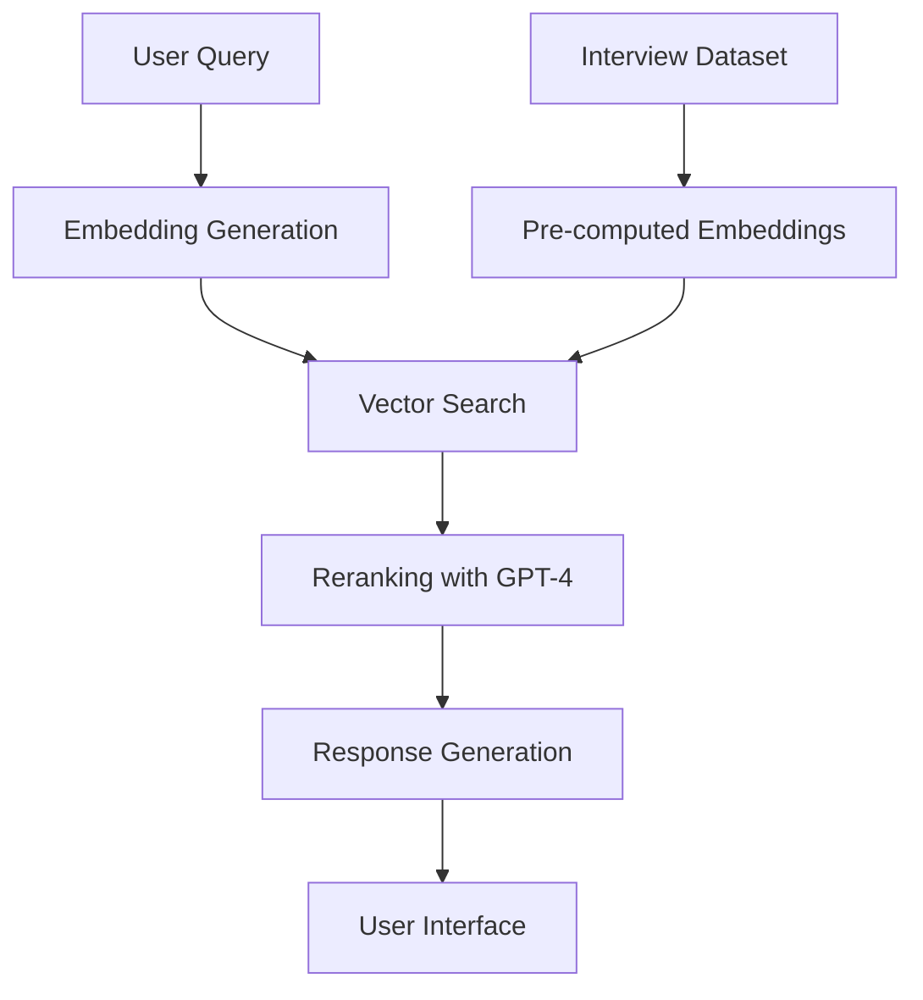

# 🎙️ Interview Transcript RAG System

<div align="center">

[](https://huggingface.co/spaces/s880453/interview-rag)
[](https://opensource.org/licenses/Apache-2.0)
[](https://huggingface.co/docs/hub/spaces-zerogpu)

</div>

## 📖 Overview

A state-of-the-art Retrieval-Augmented Generation (RAG) system designed for intelligent analysis of interview transcripts in Traditional Chinese. This system leverages advanced multilingual embeddings and GPT-4o mini to provide accurate semantic search, automated interview guide filling, and conversational AI capabilities.

## 🌟 Features

### 1. **🔍 Semantic Search**
- High-precision vector search using Multilingual-E5-Large
- Speaker-specific filtering
- Intelligent exclusion of interviewer responses
- Real-time similarity scoring

### 2. **📝 Interview Guide Filling**
- Automated question-answer matching
- Single and multi-speaker support
- Context-aware response generation
- Source attribution for transparency

### 3. **💬 Conversational AI**
- Multi-turn dialogue support
- Context-aware responses
- Dynamic retrieval and reranking
- Citation of sources

### 4. **📖 Context Expansion**
- View surrounding context (±10 turns)
- Turn index navigation
- Complete conversation threading

### 5. **🎯 Smart Filtering**
- Automatic interviewer exclusion
- Multi-speaker selection
- Non-exclusive retrieval mechanism

## 🚀 Technical Stack

- **Frontend:** Gradio 5.x with SSR support
- **Vector Model:** `intfloat/multilingual-e5-large`
- **LLM:** GPT-4o mini
- **Hardware:** Hugging Face ZeroGPU (NVIDIA H200)
- **Storage:** Hugging Face Datasets
- **Framework:** PyTorch 2.x

## 📊 Dataset

The system uses a pre-vectorized dataset stored at:
- **Dataset:** `s880453/interview-transcripts-vectorized`
- **Format:** JSONL with embeddings
- **Fields:** `file_id`, `speaker`, `turn_index`, `text`, `embedding`

## 🔧 Configuration

### Required Environment Variables

Set these in your Hugging Face Space Settings:

```bash
HF_TOKEN=your_huggingface_token
OPENAI_API_KEY=your_openai_api_key
```

### Hardware Configuration

This Space requires **ZeroGPU** hardware (available for PRO users):
- GPU: NVIDIA H200 slice
- VRAM: 70GB per workload
- Dynamic allocation for efficiency

## 📝 Usage Guide

### 1. Semantic Search
1. Enter your search query in Chinese
2. Optionally select specific speakers
3. Adjust the number of results (5-50)
4. Click "Search" to retrieve relevant content

### 2. Interview Guide Filling
1. Paste your interview questions (one per line)
2. Select target speakers
3. Choose single or multiple speaker mode
4. Click "Start Filling" to generate answers

### 3. AI Conversation
1. Select speakers to limit scope (optional)
2. Type your question in the chat
3. System will retrieve and synthesize relevant information
4. Continue the conversation with follow-up questions

### 4. Context Expansion
1. Enter a Turn Index number
2. Set the context window size (5-20)
3. View the complete conversation context

## 🏗️ Architecture



## 🔐 Security & Privacy

- All data is processed securely
- Private dataset access via HF Token
- No data persistence beyond session
- Encrypted API communications

## 📈 Performance

- **Search Latency:** < 2 seconds
- **Embedding Dimension:** 1024
- **Reranking:** Top-k with GPT-4o mini
- **Context Window:** Configurable (5-20 turns)

## 🤝 Contributing

This project is open source under the Apache 2.0 License. Contributions are welcome!

## 📄 License

Apache License 2.0 - See LICENSE file for details

## 🙏 Acknowledgments

- Hugging Face for Spaces infrastructure
- OpenAI for GPT-4o mini API
- The open-source community

## 📧 Contact

For questions or support, please open an issue on the [GitHub repository](https://github.com/s880453/interview-rag).

---

<div align="center">
Made with ❤️ using Hugging Face Spaces Pro
</div>
